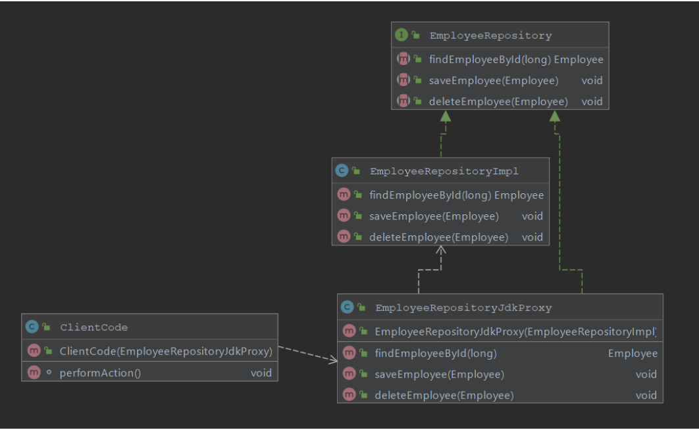
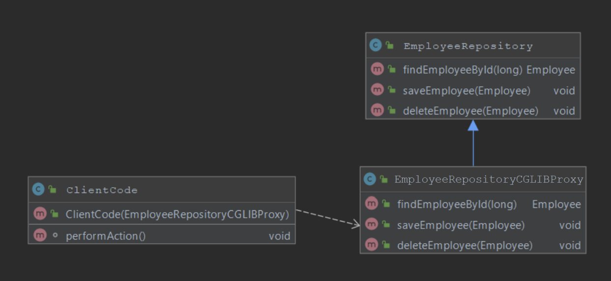
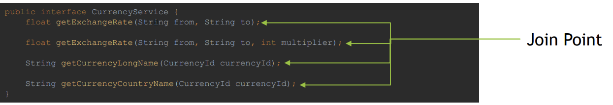
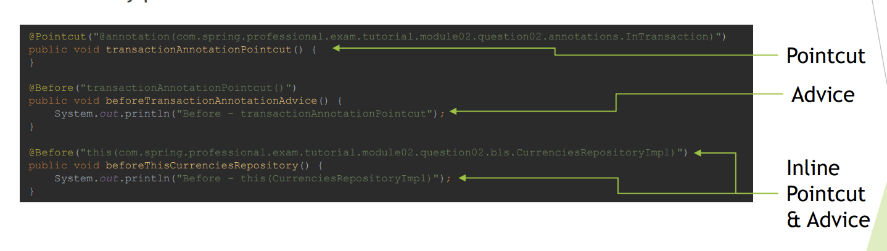
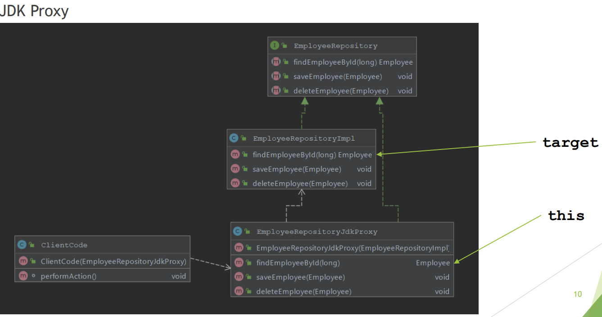
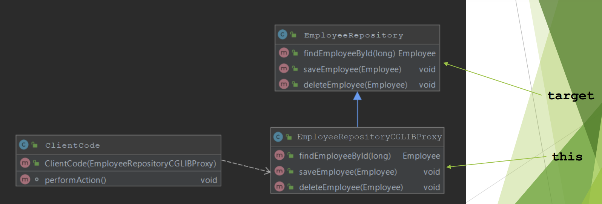
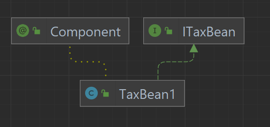
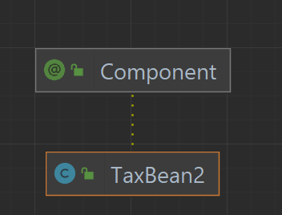
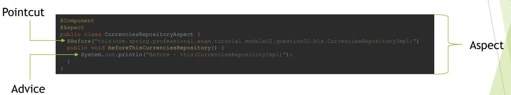
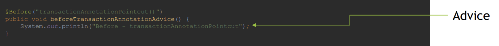

Aspect Oriented Programming - Spring AOP
----------------------------------------

Dependencies
-----------
1. org.springframework:spring-context:5.3.9
2. org.springframework:spring-aspects:5.3.9


Proxy Object
-----------
1. Proxy Object is an object that adds additional logic on top of object that is being proxied
   without having to modify code of proxied object. Proxy object has the same public methods as
   object that is being proxied and it should be as much as possible indistinguishable from proxied
   object. When method is invoked on Proxy Object, additional code, usually before and after
   sections are invoked, also code from proxied object is invoked by Proxy Object.
   1. 
   2. Example
      ```java
      public class Runner {
         public static void main(String[] args) {
         PersonDao personDao = new PersonDaoProxy(
         new PersonDaoImpl()
         );

              Person person = personDao.findById(5);
              personDao.save(person);
         }
         }
      
      //Proxy
      public class PersonDaoProxy implements PersonDao {

         private final PersonDao personDao;

         public PersonDaoProxy(PersonDao personDao) {
         this.personDao = personDao;
         }

         @Override
         public Person findById(int id) {
         System.out.println("before findById");
         Person person = personDao.findById(id);
         System.out.println("after findById");
         return person;
         }

         @Override
         public void save(Person person) {
         System.out.println("before save");
         personDao.save(person);
         System.out.println("after save");
         }
      }
      
      // Interface
      public interface PersonDao {
         Person findById(int id);

         void save(Person person);
         }
      
      //Actual Object
      public class PersonDaoImpl implements PersonDao {
         @Override
         public Person findById(int id) {
         System.out.println("Searching for person...");
         return new Person();
         }

         @Override
         public void save(Person person) {
         System.out.println("Saving person...");
         }
      }
       ```
2. Spring solve (implement) a cross cutting concern
   1. Spring Implements cross-cutting concerns with usage of Spring AOP module. Spring AOP
      uses AspectJ expression syntax for Pointcut expressions, which are matched against
      Join Point, code is altered with logic implemented in advices. In Spring AOP Joint Point
      is always method invocation.
   2. Spring AOP uses Runtime Weaving, and for each type subject to aspects, to intercepts
      calls, spring creates one type of proxy:
      1. JDK Proxy – created for classes that implements interface
      2. CGLIB Proxy – created for class that are not implementing any interface
      3. It is possible to force Spring to use CGLIB Proxy with usage of 
         1. `@EnableAspectJAutoProxy(proxyTargetClass = true)`
         

3. Spring Framework supports two kind of proxies:
   1. JDK Dynamic Proxy – used by default if target object implements interface
   2. Proxy class from java.lang.Reflection API used to create proxies
   3. Handler should implement InvocationHandler Interface
      1. Example
         ```java
         // Creating Proxy
         public class Runner {
            public static void main(String[] args) {
            PersonDao personDao = (PersonDao) Proxy.newProxyInstance(
            PersonDao.class.getClassLoader(), PersonDaoImpl.class.getInterfaces(),
            new PersonDaoInvocationHandler(
            new PersonDaoImpl()
            )
            );

                 Person person = personDao.findById(5);
                 personDao.save(person);
            }
         }
         
         //invocation Handler
         public class PersonDaoInvocationHandler implements InvocationHandler {

            private final PersonDao target;

            public PersonDaoInvocationHandler(PersonDao target) {
            this.target = target;
            }

            @Override
            public Object invoke(Object obj, Method method, Object[] args) throws Throwable {
            System.out.println("before " + method.getName());
            Object result = method.invoke(target, args);
            System.out.println("after " + method.getName());
            return result;
            }
         }
         ```
   4. CGLIB Proxy – use when target does not implement any interface
      1. Internally proxy object is created by extending the proxied (target class) 
      2. Enhancer class from org.springframework.cglib.proxy.Enhancer is used
      3. Interceptor(Handler) should implement MethodInterceptor
      4. Example
         ```java
         //creating proxy with Ehancer  
         public class Runner {
            public static void main(String[] args) {
            Enhancer enhancer = new Enhancer();
            enhancer.setCallback(new DepartmentDaoMethodInterceptor());
            enhancer.setSuperclass(DepartmentDao.class);
            DepartmentDao departmentDao = (DepartmentDao) enhancer.create();

                 Department department = departmentDao.findById(5);
                 departmentDao.save(department);
            }
            }
         
         //Handler  - Interceptor
         public class DepartmentDaoMethodInterceptor implements MethodInterceptor {
            @Override
            public Object intercept(Object object, Method method, Object[] args, MethodProxy methodProxy)          throws Throwable {
            System.out.println("before " + method.getName());
            Object result = methodProxy.invokeSuper(object, args);
            System.out.println("after " + method.getName());
            return result;
            }
         }
         ```
4. Spring usage of JDK proxy under hood
   
5. Spring usage of CGLIB proxy under hood
   
6. Limitations of JDK Dynamic Proxy:
   1. Requires proxy object to implement the interface
   2. Only interface methods will be proxied
   3. No support for self-invocation
7. Limitations of CGLIB Proxy:
   1. Does not work for final classes
   2. Does not work for final methods
   3. No support for self-invocation
   4. private methods are proxied
8. Spring Bean Method needs to have following visibility level to be proxied:
   1. JDK Dynamic Proxy – public
   2. CGLIB Proxy – public/protected/package
   3. Note: On top of requirement above, for call to be proxied, it needs to come from outside,
      both JDK Dynamic Proxy and CGLIB proxy does not support self-invocation.
9. `Proxy Advantages:
   1. Ability to change behavior of existing beans without changing original code
   2. Separation of concerns (logging, transactions, security, …)
10. Proxy Disadvantages:
    1. May create code hard to debug
    2. Needs to use unchecked exception for exceptions not declared in original method
    3. May cause performance issues if before/after section in proxy code is using IO (Network,
       Disk)
    4. May cause unexpected equals' operator (==) results since Proxy Object and Proxied Object
       are two different objects

Intro to AOP
-----------
1. AOP – Aspect Oriented Programming – A programming paradigm that complements
   Object-oriented Programming (OOP) by providing a way to separate groups of crosscutting concerns from business logic code. This is achieved by ability to add
   additional behavior to the code without having to modify the code itself. This is
   achieved by specifying:
2. Concepts
   1. Location of the code which behavior should be altered – `Pointcut` is matched
      with `Join point`
   2. Code which should be executed that implements cross-cutting concern – `Advice`
   3. `@EnableAspectJAutoProxy` should be placed at configuration file to identify the aspects
      1. Annotation @EnableAspectJAutoProxy enables detection of @Aspect classes and
         creates proxy object for beans subject to aspects. Internally process of creating proxies
         is done by AnnotationAwareAspectJAutoProxyCreator. By creating a proxy for
         each bean subject to aspects, spring intercepts the calls and implements Before / After
         / AfterReturning / AfterThrowing / Around advices.
   4. To enable detection of @Aspect annotation you need to:
      1. Have @Configuration class with @EnableAspectJAutoProxy
         1. Without @EnableAspectJAutoProxy Spring will not scan for @Aspect
      2. Have beans for @Aspect annotated classes created
         1. Use @ComponentScan with @Component at class annotated with @Aspect
         2. Use @Bean in Configuration class and create Spring Aspect Bean manually
      3. Have aspectjweaver/spring-aop on classpath
         1. It is easiest to use org.springframework:spring-aspects dependency to have
            those included
         2. Without required dependencies on classpath spring will fail with
            ClassNotFoundException/NoClassDefFoundError during creation of Proxy
            objects for Spring Beans subject to aspects
      4. Note
         1. It is important to remember that
             @Aspect will not create Spring Beans on it’s own, you need to use Component
             Scanning or manually create beans for @Aspect classes.

   5. Example
      ```java
      // config
      @Configuration
      @ComponentScan
      @EnableAspectJAutoProxy
      public class ApplicationConfiguration {
      }
      
      // Annotaion for Pointcut expression
      public @interface PerformanceLogger {
      }
      
      //Aspect
      @Aspect
      @Component
      public class PerformanceLoggerAspect {

          private Logger logger = Logger.getLogger("performance.logger");

          @Around("@annotation(com.spring.professional.exam.tutorial.module02.question01.with.aop.annotations.      PerformanceLogger)")
          public Object logPerformance(ProceedingJoinPoint proceedingJoinPoint) throws Throwable {
              long startTime = System.currentTimeMillis();
              try {
                  return proceedingJoinPoint.proceed();
              } finally {
                  long finishTime = System.currentTimeMillis();
                  Duration duration = Duration.ofMillis(finishTime - startTime);

                  logger.info(String.format("Duration of %s execution was %s", proceedingJoinPoint.      getSignature(), duration));
              }
          }
      }
      //Joint Point method annotated with @PerformanceLogger
      @Component
      public class ComplexReportFormatter {
      @PerformanceLogger
      public FormattedReport formatReport(Report report) throws InterruptedException {
      System.out.println("Formatting the report...");
      Thread.sleep(TimeUnit.SECONDS.toMillis(1));
      System.out.println("Report Formatted");

              return new FormattedReport(report);
          }
      }
      
      // Complex Logic
      @Component
      public class ComplexReportAction {
          @Autowired
          private ComplexReportFormatter complexReportFormatter;
          
          public void perform() throws InterruptedException {
              FormattedReport formattedReport = complexReportFormatter.formatReport(report);
          }
      }
      
      //main
      public class Runner {
         public static void main(String[] args) throws InterruptedException {
         AnnotationConfigApplicationContext context = new AnnotationConfigApplicationContext      (ApplicationConfiguration.class);
         context.registerShutdownHook();

              ComplexReportAction complexReportAction = context.getBean(ComplexReportAction.class);

              complexReportAction.perform();
         }
      }

       ``` 
   6. Aspect Oriented Programming solves following challenges:
      1. Allows proper implementation of Cross-Cutting Concerns
      2. Solves Code Duplications by eliminating the need to repeat the code for
         functionalities across different layers, such functionalities may include logging,
         performance logging, monitoring, transactions, caching
      3. Avoids mixing unrelated code, for example mixing transaction logic code
         (commit, rollback) with business code makes code harder to read, by separating
         concerns code is easier to read, interpret, maintain
   7. Common cross-cutting concerns:
      1. Logging
      2. Performance Logging
      3. Caching
      4. Security
      5. Transactions
      6. Monitoring
   8. Implementing cross-cutting concerns without using AOP, produces following
      challenges:
      1. Code duplications – Before/After code duplicated in all locations when normally
         Advise would be applied, refactoring by extraction helps but does not fully solve
         the problem
      2. Mixing of concerns – business logic code mixed with logging, transactions,
         caching makes code hard read and maintain

Joint Point
-----------
1. Join Point in aspect oriented programming is a point in execution of a program in which behavior can be altered by AOP.
2. In Spring AOP Join Point is always method execution.
   
3. Aspect Oriented Programming concept in general, distinguishes additional Join Points, some of them include:
   1. Method Execution / Invocation
   2. Constructor Execution / Invocation
   3. Reference / Assignment to Field
   4. Exception Handler
   5. Execution of Advice
   6. Execution of Static Initializer / Object Initializer

Point Cut
---------
1. Pointcut is a predicate used to match join point. Additional code, called Advice is executed
   in all parts of the program that are matching pointcut. Spring uses the AspectJ pointcut
   expression language by default.
2. Example of Pointcut Expressions:
   1. execution - Match Method Execution
      1. execution(* com.spring.professional.exam.tutorial.module02.question02.bls.CurrencyService.getExchangeRate(..))
   2. within - Match Execution of given type or types inside package
      1. within(com.spring.professional.exam.tutorial.module02.question02.bls.*)
   3. @within – Match Execution of type annotated with annotation
      1. @within(com.spring.professional.exam.tutorial.module02.question02.annotations.Secured)
   4. @annotation – Match join points where the subject of the join point has the given
      annotation
      1. @annotation(com.spring.professional.exam.tutorial.module02.question02.annotations.InTransaction)
   5. bean – Match by spring bean name
      1. bean(currency_service)
   6. args – Match by method arguments
      1. args(String, String, int)
   7. @args – Match by runtime type of the method arguments that have annotations of the given type
      1. @args(com.spring.professional.exam.tutorial.module02.question02.annotations.Validated)
   8. this – Match by bean reference being an instance of the given type (for CGLIB-based proxy)
      1. this(com.spring.professional.exam.tutorial.module02.question02.bls.CurrencyService)
   9. target – Match by target object being an instance of the given type
      1. target(com.spring.professional.exam.tutorial.module02.question02.bls.CurrencyService)
   10. @target – Match by class of the executing object having an annotation of the given type
       1. @target(com.spring.professional.exam.tutorial.module02.question02.annotations.Secured)
3. Inline vs external
   
4. Pointcut designator
   1. Pointcut designator types supported by Spring AOP:
      1. execution
         1. `execution([visibility modifiers] [return type] [package].[class].[method]([arguments]) [throws exceptions])`
            1. [visibility modifiers] – public/protected, if omitted all are matched, can be used with negation, for example !protected
            2. [return type] – void, primitive or Object type, cannot be omitted, can be used with wildcard *, can be used with negation, for example !int
            3. [package] – package in which class is located, may be omitted if class is located within same package as aspect, wildcard * may be used to match all packages, wildcard .. may be used to match all sub-packages
            4. [class] – Class name to match against, may be omitted, may be used with * wildcard, matches subclasses of the class as well
            5. [method] – Name of the method, whole or partial method name can be used with * wildcard
            6. [arguments] – May be empty to match methods without any arguments, may be used with wildcard .. to matchzero or more arguments, may be used with wildcard * to match all types of specific argument, may be used with !Negation
            7. [throws exceptions] – Match method that throws exceptions from given list, can be used with negation !
         2. Example
            ```java
            @Before("execution(public !int com..HelloBean.say*(String, *))")
               public void executionExample() {
               System.out.println("Before - execution example");
               }

               @After("execution(void com..HelloChildBean.validateName(..) throws java.io.IOException)")
               public void executionWithExceptionExample() {
               System.out.println("After - execution with exception matcher example");
               }

            ```
      2. within
         1. within – matches execution within specified class/classes,
            optionally you can specify class package
         2. General Form:
            `within([package].[class])`
         3. Description:
            1. [package] – package where class is located, may be used with .. wildcard (includes
               all sub-packages) or with * wildcard, may be omitted
            2. [class] – class against which match should happen, may be used with * wildcard
         4. Example
            ```java
               @Before("within(com..HelloChildBean)")
               public void withinExample1() {
               System.out.println("Before - withinExample1");
               }

               @Before("within(com..*)")
               public void withinExample2() {
               System.out.println("Before - withinExample2");
               }

               @Before("within(com..Hello*Bean)")
               public void withinExample3() {
               System.out.println("Before - withinExample3");
               }

            ```
      3. args
         1. args – matches execution of method with matching arguments
         2. General Form:
            1. `args([parameter_type1, parameter_type2, ..., parameter_typeN])`
         3. Description
            1. [parameter_typeN] – simple or object type, may be * to indicate one parameter of
               any type, may be .. to indicate zero or more arguments, you can specify type with
               the package
         4. Example
            1. ```java
               @Before("args(..)")
               public void argsExample1() {
               System.out.println("Before - argsExample1");
               }

               @Before("args(String, int)")
               public void argsExample2() {
               System.out.println("Before - argsExample2");
               }

               @Before("args(String, *)")
               public void argsExample3() {
               System.out.println("Before - argsExample3");
               }

               @Before("args(java.lang.String)")
               public void argsExample4() {
               System.out.println("Before - argsExample4");
               }

               ```
      4. bean
         1. – bean – matches execution of method with matching Spring Bean
            Name
         2. General Form:
            1. `bean([beanName])`
         3. Description:
            1. [beanName] – name of the Spring Bean (automatically generated by framework, or
               set manually)
         4. Example
            ```java
            @Before("bean(hello_child_bean)")
            public void beanExample1() {
            System.out.println("Before - beanExample1");
            }

            @Before("bean(hello_*_bean)")
            public void beanExample2() {
            System.out.println("Before - beanExample2");
            }

             ```
      5. this
         1. this – matches execution against type of proxy that was
            generated by Spring AOP
         2. General Form:
            1. this([type])
         3. Description:
            1. [type] – type of the proxy, matches if generated proxy is of specified type
      6. target
         1. target – matches execution against type of the target object
            invoked by proxy
         2. General Form:
            1. target([type])
         3. Description:
            1. [type] – type of the target object invoked by proxy, matches if target object is of
               specified type
         4. Working of target and this
            1. JDK and this and target references
               
            2. CBLib and this and target references
               
            3. Example
               1. Project structure
                  
               2. 
               3. In context of JDK proxy
                  ```java
                  @Before("this(com.spring.professional.exam.tutorial.module02.question07.beans.ITaxBean)")
                  public void thisTaxBean1Example1() {
                  System.out.println("Before - thisTaxBean1Example1");
                  }

                  @Before("this(com.spring.professional.exam.tutorial.module02.question07.beans.TaxBean1)")
                  public void thisTaxBean1Example2() {
                  System.out.println("Before - thisTaxBean1Example2");
                  }

                  @Before("target(com.spring.professional.exam.tutorial.module02.question07.beans.ITaxBean)")
                  public void targetTaxBean1Example1() {
                  System.out.println("Before - targetTaxBean1Example1");
                  }

                  @Before("target(com.spring.professional.exam.tutorial.module02.question07.beans.TaxBean1)")
                  public void targetTaxBean1Example2() {
                  System.out.println("Before - targetTaxBean1Example2");
                  }

                   ```
               4. In context of CBLib proxy
                  ```java
                  @Before("this(com.spring.professional.exam.tutorial.module02.question07.beans.TaxBean2)")
                  public void thisTaxBean2Example() {
                  System.out.println("Before - thisTaxBean2Example");
                  }

                  @Before("target(com.spring.professional.exam.tutorial.module02.question07.beans.TaxBean2)")
                  public void targetTaxBean2Example() {
                  System.out.println("Before - targetTaxBean2Example");
                  }

                   ```
      7. @annotation
         1. @annotation – matches method execution annotated with
            specified annotation
         2. General Form:
            1. @annotation([annotation_type])
         3. Description:
            1. [annotation_type] – type of annotation used to annotated method which should
               match pointcut expression
         4. Example
            ```java
            @Before("@annotation(com.spring.professional.exam.tutorial.module02.question07.annotation.CustomTransaction)")
               public void annotationExample() {
               System.out.println("Before - annotationExample");
               }
            
            // Annotation
            public @interface CustomTransaction {
            }
            
            //Annotation of target method
            @Component("hello_child_bean")
            public class HelloChildBean extends HelloBean { 
            @CustomTransaction
              public void saveCounterValue(int counterValue) {
              }
              }

            ```
      8. @args
         1. – @args – matches method execution with `argument`, which types
            (classes) are annotated with specified annotation type, note that class should be
            annotated, not the argument of method itself
         2. General Form:
            1. @args([annotation_type])
         3. Description:
            1. [annotation_type] – type of annotation used on top of class, which represents
               type of argument
         4. Example
            ````java
            //aspect
            @Before("@args(com.spring.professional.exam.tutorial.module02.question07.annotation.CustomValidation)")
               public void argsAnnotationExample()
               {
               System.out.println("Before - @argsExample");
               }
            
            // Annoatation
            public @interface CustomValidation {
             }
            
            //target type Annotated with @CustomValidation
            @CustomValidation
            public class Person {
            }
            
            //Target Method on which aspect advice will trigger having argument Person
            @Component("hello_child_bean")
            public class HelloChildBean extends HelloBean { 
                public void savePerson(Person person) {
                 }
            }
            

              ````
      9. @within
         1. – @within – matches method executions inside classes annotated
            with specified annotation - matches class that are annotated, all methods in target class
         2. General Form:
            1. @within([annotation_type])
         3. Description:
            1. [annotation_type] – type of annotation used on top of class, inside which
               method execution should be matched
         4. Example
            ```java
            //aspect
            @Before("@within(com.spring.professional.exam.tutorial.module02.question07.annotation.MonitoredRepository)")
               public void annotationWithinExample() {
               System.out.println("Before - annotationWithinExample");
               }
            
            //annotation
            @Retention(RetentionPolicy.RUNTIME)
            public @interface MonitoredRepository {
            }
            
            // class annotated 
            @Component
            @MonitoredRepository
            public class DepartmentRepository {

                public Department findDepartment(String pattern) {
                    return new Department();
                }

                public void updateDepartment(int id, Department department) {
                }
            }
            ```
      10. @target
          1. @target – matches method executions inside proxied target class
             that is annotated with specific annotation
          2. General Form:
             1. @target([annotation_type])
          3. Description:
             1. [annotation_type] – type of annotation used on top of proxied class, inside
                which method execution should be matched
          4. Example
             ```java
             @Before("@target(com.spring.professional.exam.tutorial.module02.question07.annotation.MonitoredRepository)")
                public void annotationTargetExample() {
                System.out.println("Before - annotationTargetExample");
                }

             ```
             
5. Pointcut expressions can be combined together with usages of logical operators:
   1. ! – negation
   2. || - logical or
   3. && - logical and
   4. Example
      1. Matching all getters and setters
         ````java
         @Before("execution(* com.spring.professional.exam.tutorial.module02.question07.beans.EmployeeBean.get*()) || execution(* com.spring.professional.exam.tutorial.module02.question07.beans.EmployeeBean.set*(*))")
           public void beforeGetterOrSetter(JoinPoint joinPoint) {
           System.out.println("beforeGetterOrSetter " + joinPoint.getSignature());
           }
         ````
      
Advice
-----
1. Advice is additional behavior that will be inserted into the code, at each join point
   matched by pointcut.
2. Aspect brings together Pointcut and Advice. Usually it represents single behavior
   implemented by advice that will be added to all join points matched by pointcut.
   
3. Example
   
4. Spring supports following advice types:
   1. @Before – executed before joint point matched by pointcut is executed
      1. Use cases
         1. Authorization, Security, Logging, Data Validation
   2. @After – executed after joint point matched by pointcut is executed
      1. Use cases
         1. Logging, Resource Cleanup
   3. @AfterThrowing – executed when exception is thrown from joint point matched by
      pointcut
      1. Use cases
         1. Logging, Error Handling
   4. @AfterReturning – executed after joint point matched by pointcut is executed
      successfully without any exception
      1. Use cases
         1. Logging, Data validation for method result
   5. @Around – allows you to take full control over joint point matched by pointcut,
      most powerful advice, allows you to implement all advices from above, you need to
      call ProceedingJoinPoint::proceed() to execute original code
      1. Use cases
         1. transactions
         2. Distrubuted call tracing
         3. Authorization, Security
   6. Example
      ```java
      @Aspect
      @Component
      public class EmployeeRepositoryAspect {
      @Pointcut("within(adviceTypes.repo.*)")
      public void serviceOrSamePackageRepository()
      {}

      @Before("serviceOrSamePackageRepository()")
      public void before(JoinPoint joinPoint)
      {
          System.out.println("before - " + joinPoint.getSignature());
      }

      @After("serviceOrSamePackageRepository()")
      public void after(JoinPoint joinPoint)
      {
          System.out.println("after - " + joinPoint.getSignature());
      }

      @AfterThrowing(value = "serviceOrSamePackageRepository()", throwing = "exception")
      public void afterThrowing(JoinPoint joinPoint, Exception exception)
      {
          System.out.println("after throwing exception - " + joinPoint.getSignature() + " - exception = " +   exception);
      }

      @AfterReturning(value = "serviceOrSamePackageRepository()", returning = "returnValue")
      public void afterReturning(JoinPoint joinPoint, Object returnValue) {
          System.out.println("after returning " + joinPoint.getSignature() + " - returnValue = " +   returnValue);
      }

      @Around("serviceOrSamePackageRepository()")
      public Object around(ProceedingJoinPoint joinPoint) throws Throwable {
          System.out.println("around - before - " + joinPoint.getSignature());
          try {
              return joinPoint.proceed();
          } finally {
              System.out.println("around - after - " + joinPoint.getSignature());
          }
      }

       ```
Weaving
-------
1. Weaving is the process of applying aspects, which modifies code behavior at join
   points that have matching pointcuts and associated advices. During weaving aspects
   and application code is combined which enables execution of cross-cutting concerns.
2. Types of weaving:
   1. Compile Time Weaving – byte code is modified during the compilation, aspects are
      applied, code is modified at join points matching pointcuts by applying advices
   2. Load Time Weaving – byte code is modified when classes are loaded by class
      loaders, during class loading aspects are applied, code is modified at join points
      matching pointcuts by applying advices
   3. `Runtime Weaving` – used by Spring AOP, for each object/bean subject to aspects,
      proxy object is created `(JDK Proxy or CGLIB Proxy)`, proxy objects are used instead
      of original object, at each join point matching pointcut, method invocation is
      changed to apply code from advice


Arguments of Adive methods
-------------------------
1. JoinPoint argument
   1. JoinPoint argument is an object that can be used to retrieve additional information about join point during execution.
   2. JoinPoint needs to be the first parameter of Advice, only in that case Spring Framework will inject
      JoinPoint into advice method.
   3. Join Point is supported in following advice types:
      1. Before
      2. After
      3. After Returning
      4. After Throwing
   4. Examples of information that you can retrieve from JoinPoint:
      1. String representation of Join Point
      2. Arguments of Joint Point (for example Method Arguments)
      3. Signature of Joint Point (for example Method Signature)
      4. Kind / Type of Joint Point
      5. Target / This object being proxied
   5. Example
      ```java
          @Before("execution(* com..HelloBean.formatData(..))")
             public void beforeHelloBean(JoinPoint joinPoint) {
             System.out.println("HelloBeanAspect::beforeHelloBean <- start");

                  System.out.println("Join Point = " + joinPoint.getStaticPart().toLongString());
                  System.out.println("Signature = " + joinPoint.getSignature());
                  System.out.println("Args = " + Arrays.toString(joinPoint.getArgs()));
                  System.out.println("Kind = " + joinPoint.getKind());

                  System.out.println("HelloBeanAspect::beforeHelloBean <- stop\n\n");
             }

      ```

2. ProceedingJoinPoint argument
   1. ProceedingJoinPoint is an object that can be provided to @Around advice as first
      argument, it is a type of JoinPoint which can be used to change method arguments
      during method execution in runtime or block execution of original method entirely.
   2. ProceedingJoinPoint is used in @Around advice, it contains all methods from
      JoinPoint and also adds:
      1. proceed – executes original method
      2. proceed(args) – executes original method with provided arguments
   3. ProceedingJoinPoint can be used in following use cases:
      1. Conditionally block method execution
      2. Filter arguments
      3. Inject additional argument
   4. Example
      ```java
      @Component
      @Aspect
      public class SanitizeAspect {
      @Around("execution(* com..beans.*.*(*, ..))")
      public Object around(ProceedingJoinPoint proceedingJoinPoint) throws Throwable {
      MethodSignature methodSignature = (MethodSignature) proceedingJoinPoint.getSignature();

              return proceedingJoinPoint.proceed(
                      sanitizeArgumentsIfRequired(
                              proceedingJoinPoint.getArgs(),
                              methodSignature
                      )
              );
          }

          private Object[] sanitizeArgumentsIfRequired(Object[] args, MethodSignature methodSignature) {
              Object[] filteredArgs = new Object[args.length];
              for (int i = 0; i < args.length; i++) {
                  filteredArgs[i] = sanitizeArgumentIfRequired(
                          args[i],
                          methodSignature.getMethod().getParameterAnnotations()[i]
                  );
              }
              return filteredArgs;
          }

          private Object sanitizeArgumentIfRequired(Object arg, Annotation[] parameterAnnotations) {
              if (containsAnnotationOfType(parameterAnnotations, Sanitize.class) && arg.getClass() ==       String.class)
                  return "***sanitized***";
              else
                  return arg;
          }

          private boolean containsAnnotationOfType(Annotation[] parameterAnnotations, Class sanitizeClass) {
              return Arrays.stream(parameterAnnotations)
                      .map(Annotation::annotationType)
                      .anyMatch(sanitizeClass::equals);
          }
       }

         ```


      

