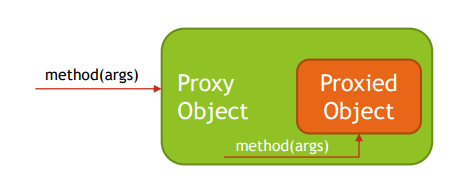

Aspect Oriented Programming - Spring AOP
----------------------------------------

Dependencies
-----------
1. org.springframework:spring-context:5.3.9
2. org.springframework:spring-aspects:5.3.9


Proxy Object
-----------
1. Proxy Object is an object that adds additional logic on top of object that is being proxied
   without having to modify code of proxied object. Proxy object has the same public methods as
   object that is being proxied and it should be as much as possible indistinguishable from proxied
   object. When method is invoked on Proxy Object, additional code, usually before and after
   sections are invoked, also code from proxied object is invoked by Proxy Object.
   1. 
   2. Example
      ```java
      public class Runner {
         public static void main(String[] args) {
         PersonDao personDao = new PersonDaoProxy(
         new PersonDaoImpl()
         );

              Person person = personDao.findById(5);
              personDao.save(person);
         }
         }
      
      //Proxy
      public class PersonDaoProxy implements PersonDao {

         private final PersonDao personDao;

         public PersonDaoProxy(PersonDao personDao) {
         this.personDao = personDao;
         }

         @Override
         public Person findById(int id) {
         System.out.println("before findById");
         Person person = personDao.findById(id);
         System.out.println("after findById");
         return person;
         }

         @Override
         public void save(Person person) {
         System.out.println("before save");
         personDao.save(person);
         System.out.println("after save");
         }
      }
      
      // Interface
      public interface PersonDao {
         Person findById(int id);

         void save(Person person);
         }
      
      //Actual Object
      public class PersonDaoImpl implements PersonDao {
         @Override
         public Person findById(int id) {
         System.out.println("Searching for person...");
         return new Person();
         }

         @Override
         public void save(Person person) {
         System.out.println("Saving person...");
         }
      }
       ```
3. Spring Framework supports two kind of proxies:
   1. JDK Dynamic Proxy – used by default if target object implements interface
   2. Proxy class from java.lang.Reflection API used to create proxies
   3. Handler should implement InvocationHandler Interface
      1. Example
         ```java
         // Creating Proxy
         public class Runner {
            public static void main(String[] args) {
            PersonDao personDao = (PersonDao) Proxy.newProxyInstance(
            PersonDao.class.getClassLoader(), PersonDaoImpl.class.getInterfaces(),
            new PersonDaoInvocationHandler(
            new PersonDaoImpl()
            )
            );

                 Person person = personDao.findById(5);
                 personDao.save(person);
            }
         }
         
         //invocation Handler
         public class PersonDaoInvocationHandler implements InvocationHandler {

            private final PersonDao target;

            public PersonDaoInvocationHandler(PersonDao target) {
            this.target = target;
            }

            @Override
            public Object invoke(Object obj, Method method, Object[] args) throws Throwable {
            System.out.println("before " + method.getName());
            Object result = method.invoke(target, args);
            System.out.println("after " + method.getName());
            return result;
            }
         }
         ```
   4. CGLIB Proxy – use when target does not implement any interface
      1. Enhancer class from org.springframework.cglib.proxy.Enhancer is used
      2. Interceptor(Handler) should implement MethodInterceptor
      3. Example
         ```java
         //creating proxy with Ehancer
         public class Runner {
            public static void main(String[] args) {
            Enhancer enhancer = new Enhancer();
            enhancer.setCallback(new DepartmentDaoMethodInterceptor());
            enhancer.setSuperclass(DepartmentDao.class);
            DepartmentDao departmentDao = (DepartmentDao) enhancer.create();

                 Department department = departmentDao.findById(5);
                 departmentDao.save(department);
            }
            }
         
         //Handler  - Interceptor
         public class DepartmentDaoMethodInterceptor implements MethodInterceptor {
            @Override
            public Object intercept(Object object, Method method, Object[] args, MethodProxy methodProxy)          throws Throwable {
            System.out.println("before " + method.getName());
            Object result = methodProxy.invokeSuper(object, args);
            System.out.println("after " + method.getName());
            return result;
            }
         }
         ```
4. Limitations of JDK Dynamic Proxy:
   1. Requires proxy object to implement the interface
   2. Only interface methods will be proxied
   3. No support for self-invocation
5. Limitations of CGLIB Proxy:
   1. Does not work for final classes
   2. Does not work for final methods
   3. No support for self-invocation
6. Proxy Advantages:
   1. Ability to change behavior of existing beans without changing original code
   2. Separation of concerns (logging, transactions, security, …)
7. Proxy Disadvantages:
   1. May create code hard to debug
   2. Needs to use unchecked exception for exceptions not declared in original method
   3. May cause performance issues if before/after section in proxy code is using IO (Network,
      Disk)
   4. May cause unexpected equals' operator (==) results since Proxy Object and Proxied Object
      are two different objects